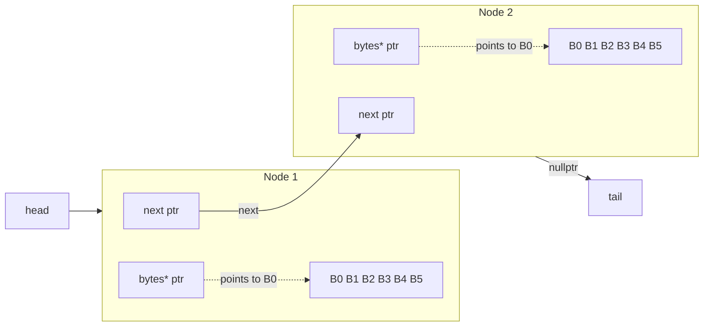

# CS-351-Tennison
Computer Architecture Class
* William (Scott) Tennison
  
* Project 1
  
**Which program is fastest? Is it always the fastest?**
  
Alloca is the fastest. It isn't always the fastest, when node data size increases alloca is the slowest.

**Which program is slowest? Is it always the slowest?**

List is the slowest.  No, it is a little faster than alloca at bigger node data sizes.

**Was there a trend in program execution time based on the size of data in each Node? If so, what, and why?**

Yes. With the more data in the nodes, the longer it took to execute. With more data,more memory had to be used.

**Was there a trend in program execution time based on the length of the block chain?**

Yes. With longer block chains, the longer the execution time. 

**Consider heap breaks, what's noticeable? Does increasing the stack size affect the heap? Speculate on any similarities and differences in programs?
One noticeable thing is that alloca stays at 69 heap requests no matter the length of the list, while the other three programs grow greatly.
Considering either the malloc.cpp or alloca.cpp versions of the program, generate a diagram showing two Nodes. Include in the diagram
the relationship of the head, tail, and Node next pointers.
show the size (in bytes) and structure of a Node that allocated six bytes of data
include the bytes pointer, and indicate using an arrow which byte in the allocated memory it points to.**

**There's an overhead to allocating memory, initializing it, and eventually processing (in our case, hashing it). For each program, were any of these tasks the same? Which one(s) were different?**

Each program went through the lists the same,since they all had the same hash value. 
The difference was how each node was allocated and constructed. Alloca used the stack while the other programs used the heap.

**As the size of data in a Node increases, does the significance of allocating the node increase or decrease?**

As the data in a node increases,the significance of allocating the node decreases. With more data the hashing and initializing times become bigger than the allocation times.
